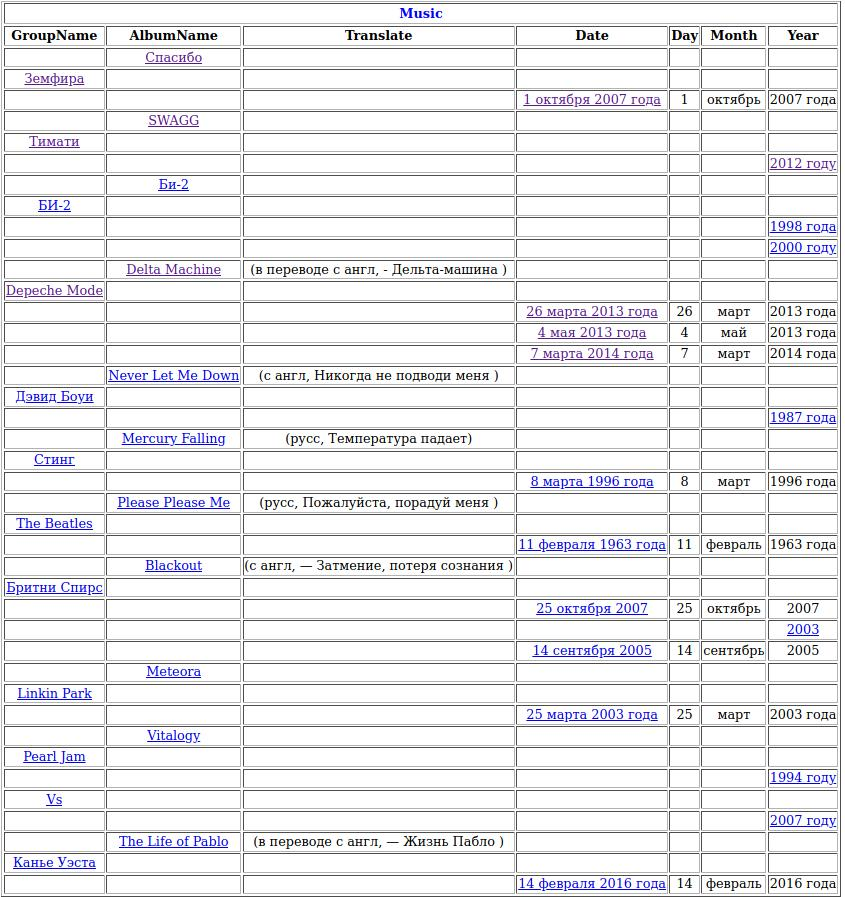

**Задани:**  
Взять файл с текстами Music_albums.txt  
Написать грамматику для Томиты, которая извлечь из этого файла альбомы
Надо узвлечь поля - 

    Название, 
    Перевод названия(если есть), 
    год выхода, 
    Исполнителя

[Пример разработки грамматики для томиты-парсера](http://alkozko.ru/blog/post/tomita-film-extraction)

[Документация по Томите-парсеру](https://tech.yandex.ru/tomita/doc/dg/concept/about-docpage/)

[Ссылка на бинарник](http://download.cdn.yandex.net/tomita/tomita-win32.zip)

[Томита-парсер. Задание 1](https://eu.iit.csu.ru/mod/url/view.php?id=74595)  
___
**Examples**  
[1](https://alexeykalina.github.io/technologies/tomita-parser.html)
[2](https://cs.hse.ru/data/2015/04/27/1098338342/Tomita_hse_20_04_15.pdf)
[3](https://habr.com/ru/company/yandex/blog/225723/)
[4](https://docplayer.ru/27701308-Tomita-parser-bystryy-start.html)
[5](https://github.com/vas3k/poor-python-yandex-tomita-parser/tree/master/example)  
[6 - Yandex examples](https://github.com/yandex/tomita-parser/tree/master/examples)
___

File  | Description
--- | --- |  
config.proto|— Конфигурационный файл парсера. Сообщает парсеру, где искать все остальные файлы, как их интерпретировать и что делать. 
mydic.gzt|— Корневой словарь. Содержит перечень всех используемых в проекте словарей и грамматик.  
facttypes.proto|— Описание типов фактов. Нужен, если в проекте порождаются факты. Парсер запустится без него, но фактов не будет.  
Music.cxx|— грамматика  
Music_albums.txt|— текст, который необходимо распарсить.  
___
**Результат :**
___
  
___

